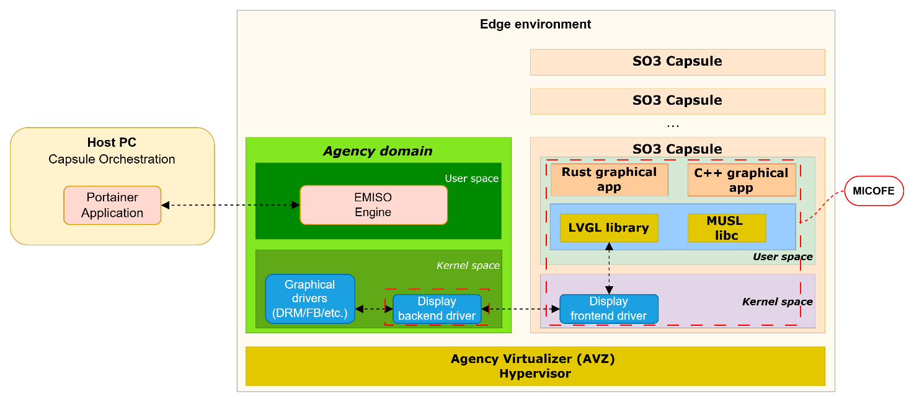

.. _architecture:

Architecture
############

The overall approach combines the *SOO* mobile entity concept with the *SO3*
operating system, running on top of the *Agency Virtualizer (AVZ)* hypervisor.
Micro-services are deployed as **SO3 capsules** — strongly isolated containers
that run alongside a full Linux environment (the *agency domain*).

   General architecture of the edge environment

The dashed *MICOFE* rectangle in the figure above highlights the components
developed as part of the project. With the exception of Rust support — which
could not be delivered due to time and budget constraints — all other components
were implemented, tested, and validated.

The main building blocks are:

* The :ref:`EMISO <emiso>` engine, running in the agency domain user space, which
  manages the lifecycle of the SO3 capsules.
* :ref:`Portainer <portainer>`, used as the *Container Orchestration User Interface*
  (COUI), running on the host PC.
* The :ref:`MUSL libc <syscalls>` runtime and the SO3 syscall layer, which allow
  standard applications to run unmodified inside capsules.
* The :ref:`C++ <cpp>` user-space runtime, built on top of the MUSL-aligned C
  runtime.
* The :ref:`capsule / LVGL integration <lvgl>`, which gives graphical capsules
  access to the display through a backend/frontend driver pair and the AVZ
  hypervisor.
