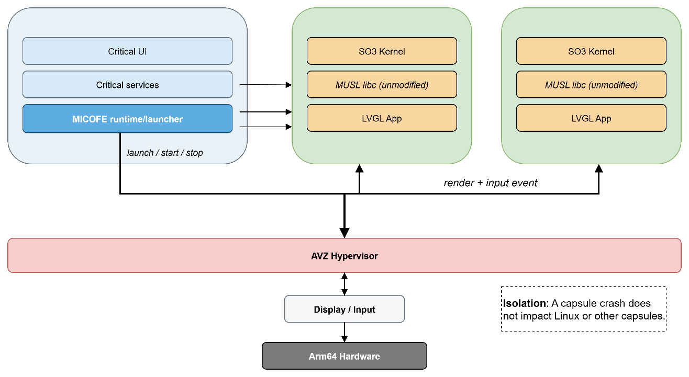
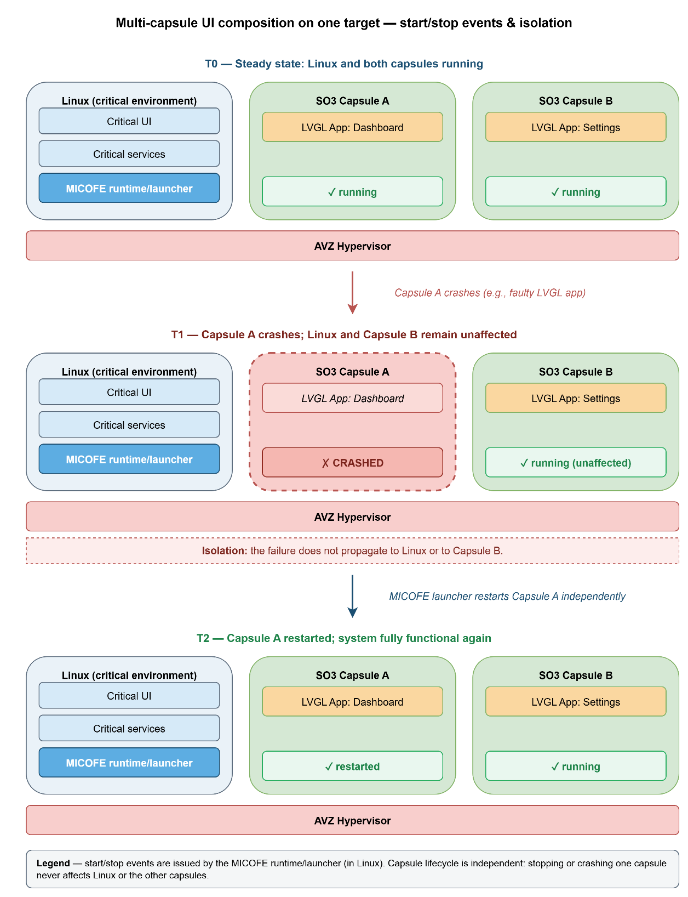
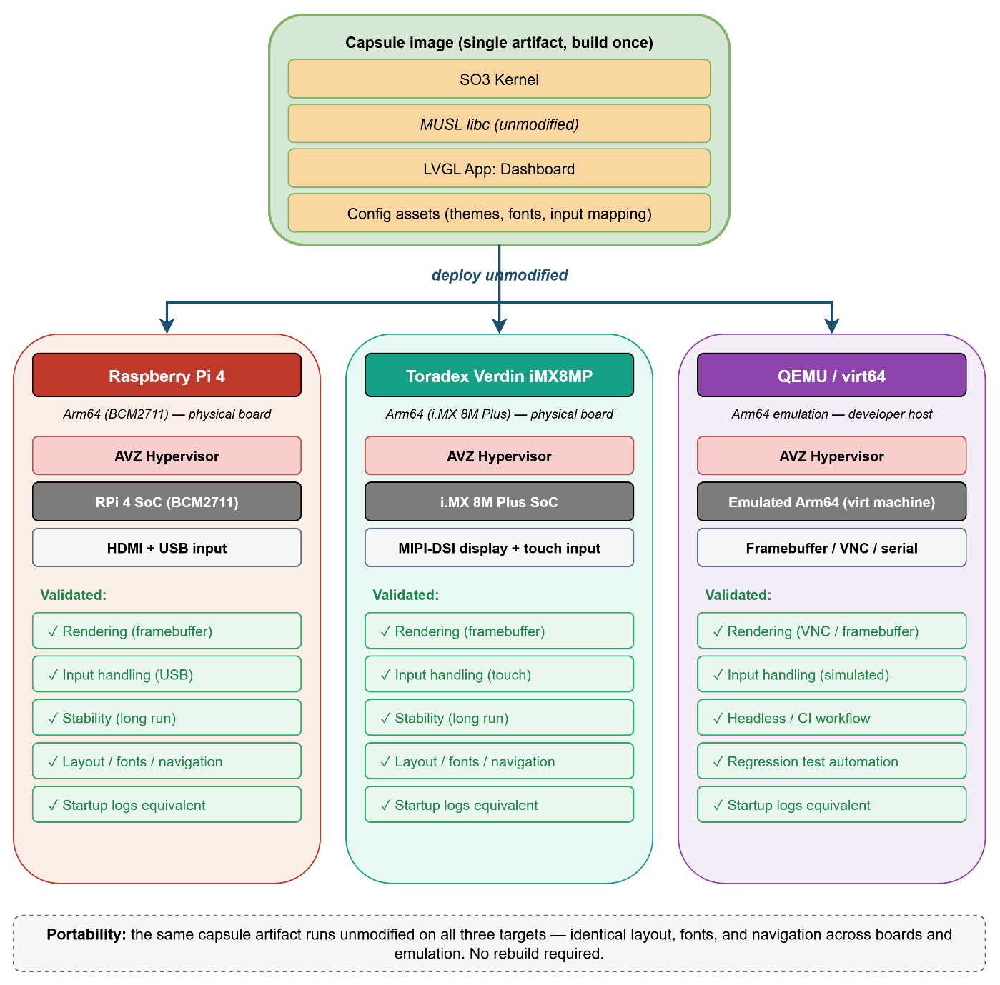

.. _demonstrator:

Demonstrator and showcase
#########################

This chapter presents a lightweight demonstrator designed to showcase the value of
MICOFE capsules for graphical applications (LVGL) running on SO3 alongside a
Linux-based "critical" environment. The goal is not to benchmark performance but to
illustrate isolation, composability (multiple capsules on the same target), and
portability (the same capsule across heterogeneous Arm platforms).

Two complementary demonstration scenarios are implemented:

* **Scenario 1 — Multi-capsule composition on a single target:** multiple SO3
  capsules, each running a distinct LVGL application, execute on the same hardware
  while Linux continues to run the "critical" user interface and services.
* **Scenario 2 — Portability across heterogeneous platforms:** the same capsule
  image runs unmodified on different Arm targets (e.g., Raspberry Pi 4, Toradex
  Verdin iMX8MP) and on an emulated platform (QEMU/virt64), demonstrating a
  consistent UI across boards.

Demonstrator principles
***********************

The demonstrator is intentionally built on top of the core deliverables described
in the previous chapters: a SO3 user space able to run standard applications with
MUSL (without patching MUSL), and the kernel-side syscall compatibility required by
typical LVGL-based UIs. The showcase therefore focuses on the end-to-end
experience: building a capsule, launching it next to Linux, and validating that the
UI behaves consistently across targets.

   Showcase architecture (Linux "critical UI" + multiple SO3 capsules)

Demonstrator setup and prerequisites
************************************

This section summarizes the environment used to run the showcase and the artifacts
required to reproduce it.

* **Targets:** Raspberry Pi 4 (Arm64), Toradex Verdin iMX8MP (Arm64), and
  QEMU/virt64 for emulation-based runs.
* **Host environment:** a Linux development machine with the SO3 build environment
  and the capsule build tooling.
* **Software stack:** Linux used as the "critical" environment; SO3 as the capsule
  OS; MUSL as the system libc inside capsules; LVGL applications as the showcased
  workloads.
* **Artifacts:** one or more capsule images that embed (1) the SO3 user space,
  (2) an LVGL application, and (3) its configuration assets (themes, fonts, input
  mapping, etc.).

Scenario 1 — Multi-capsule composition next to a Linux "critical UI"
********************************************************************

This scenario demonstrates how MICOFE can support the deployment of graphical
applications that interact with a Linux-based critical environment, while keeping
those applications isolated inside SO3 capsules. The key message is composability:
multiple independent UI capsules can coexist on the same target, with Linux
retaining control over the critical interface and any safety- or security-sensitive
services.

#. **Prepare capsules:** build at least two capsules, each embedding a different
   LVGL application (e.g., "Dashboard" and "Settings").
#. **Boot the platform:** start Linux as the base environment and bring up the
   critical UI (or a representative placeholder UI) on the main display.
#. **Launch capsules:** start the SO3 capsules from Linux using the MICOFE
   runtime/launcher.
#. **Validate isolation:** intentionally stop or restart one capsule and verify
   that the Linux critical UI and the other capsule keep running.
#. **Validate interaction contract:** verify that the capsules only access shared
   resources through explicit, controlled interfaces (e.g., a device, a service
   endpoint, or a pre-defined IPC mechanism), rather than ad-hoc shared state.

**Success criteria.** The scenario is considered successful when:

* Each capsule UI starts reliably and renders correctly using LVGL.
* A failure (crash/kill) of one capsule does not affect Linux or other capsules.
* The capsule's behavior matches expectations for a MUSL-based environment (no MUSL
  patching required, and missing syscalls fail cleanly with ``ENOSYS`` where
  applicable).
* Startup/shutdown cycles are repeatable without leaving the system in an
  inconsistent state (e.g., resources released, no deadlocks in basic futex-based
  synchronization).

   Multi-capsule UI composition on one target

Scenario 2 — Capsule portability across boards and emulation
************************************************************

This scenario demonstrates platform heterogeneity: the same capsule image can be
deployed across different Arm64 systems (and in QEMU) while providing a consistent
UI. The intent is to show that the capsule encapsulates its user space (MUSL +
application) and that the kernel interface exposed by SO3 remains sufficiently
stable across targets.

#. **Select a reference capsule:** choose one LVGL capsule (e.g., "Dashboard") as
   the portability baseline.
#. **Run on Raspberry Pi 4:** deploy the capsule and confirm correct rendering and
   input handling.
#. **Run on Verdin iMX8MP:** deploy the exact same capsule image and confirm
   identical functional behavior (layout, fonts, navigation).
#. **Run on QEMU/virt64:** boot an emulated target and run the capsule to validate
   developer-friendly workflows (CI, regression tests, headless automation where
   applicable).
#. **Compare outputs:** record a small set of checks (startup logs, a few
   screenshots, and basic UI interactions) and verify equivalence across the three
   environments.

   Portability matrix (same capsule across targets)

Discussion, limitations, and next steps
***************************************

Together, the two scenarios provide an end-user-oriented validation of the
project's technical choices. Scenario 1 makes the isolation and composition
benefits tangible (multiple independent UIs running in parallel next to Linux),
while Scenario 2 demonstrates that capsules are a practical distribution format
across heterogeneous targets.

Observed/expected limitations
=============================

Based on the current SO3 syscall surface and MUSL alignment (see
:ref:`MUSL libc support <syscalls>`), the demonstrator intentionally stays within a
"baseline application" envelope:

* Not all Linux flags/options are supported for every syscall (e.g., reduced
  ``mmap`` flags; limited ``clone`` flag set; reduced ``futex`` operations). The
  showcase therefore avoids advanced behaviors that rely on those options.
* Unimplemented syscalls return ``ENOSYS``; the demonstrator is designed so such
  cases are either not triggered or are easy to diagnose in logs.
* The demonstrator focuses on functionality and integration rather than on
  performance or real-time guarantees.

Next steps
==========

Building on the current demonstrator and the MUSL-based runtime, several extensions
are natural candidates for future work. The two most prominent are native Rust
support on top of SO3 and broader GPU coverage for graphical capsules.

* **Rust support.** Completing Rust support so that capsules can host applications
  written in both C++ and Rust on top of the same MUSL-aligned runtime. This will
  require a dedicated Rust toolchain targeting SO3, including a stable mapping
  between Rust's standard library expectations and the existing syscall surface, as
  well as packaging guidelines for Rust-based capsules. In the medium term, Rust
  support will make it easier to explore memory-safe system components and
  higher-level services inside capsules.
* **Broader GPU coverage.** The current demonstrator focuses on a specific class of
  GPUs and display pipelines. A natural evolution is to extend the GPU abstraction
  layer so that LVGL-based capsules can be reused across a wider range of SoCs and
  boards without reworking the application logic. This involves separating
  board-specific display integration (framebuffer, composition, input routing) from
  the capsule-visible interfaces, and validating the approach on additional GPU
  families and display controllers.
* **Transversal improvements.** Hardening the Linux-capsule interaction contract by
  documenting and implementing a small, well-defined set of services for
  configuration, monitoring, and logging, usable consistently across capsules and
  targets. Another is to industrialize the current demonstrator into a reusable
  reference platform, with scripted deployment, regression tests, and example
  capsules that can serve as templates for future industrial or academic projects.
