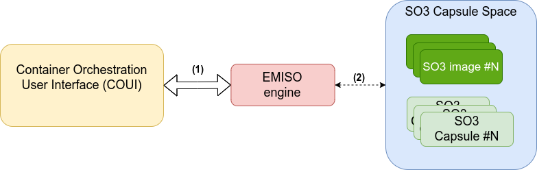
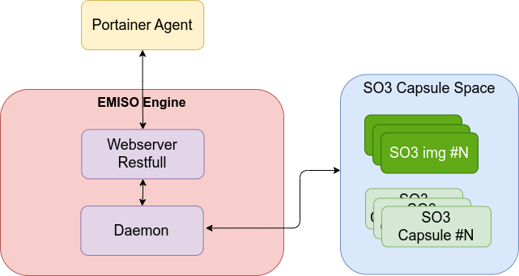
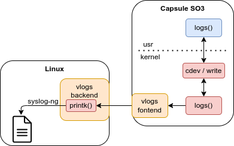

.. _emiso:

EMISO
#####

EMISO exploits the concept of mobile entity developed in the context of the
SOO virtualization framework developed in the REDS Institute to provide an innovative
approach to manage micro-services in embedded systems using a highly secure virtualized
environment combined with the ARM TrustZone technology.

It will allow the end customer to benefit from a complete Linux environment. In
other words, where Docker containers are mainly used in today's solutions to deploy
services in embedded systems, we propose to use a new model of container based on
our SOO mobile entity concept which is based itself on the SO3 operating system.

	Communication flow

**Legends**

	(1) The Portainer Server communicates directly with the EMISO Engine running
	    on the Smart Object. The communication is done via HTTP or HTTPS/TLS using
	    a RESTful API
	(2) EMISO Engine provides an interface to control the SO3 capsule.

The application can be called as following:

.. code-block:: shell

	$ emiso_engine [-s] [-i]

Where

* (optional) ``-s``: Start the webserver in secure mode (HTTPS/TLS)

.. note::

	Due to some `limitation <https://github.com/portainer/portainer/issues/8011>`_
	with `Portainer` Server, the Secure mode is not supported

Service
*******

A ``emiso`` service has been added to help control the engine. Currently this
service only starts the ``emiso-engine``.

Usage:

* Control

.. code-block:: shell

	systemctl {start,stop,status,restart} emiso.service

* Retrieve logs

.. code-block:: shell

	journalctl -fu emiso.service

Architecture
************

The following picture depicts the architecture of the EMISO engine.

	Engine Architecture

The different blocks of the engine are:

* A web server compliant with a subset of the Docker APIs.
* EMISO Daemon handles the interactions with the SO3 Capsules

Daemon
******

The EMISO engine *Daemon* provides an interface to interact with the SO3 capsule.
SO3 capsule are SOO Mobile Entity (ME). ME has been instrumented to be controlled
by the daemon.

The following table provides the mapping between the Docker and SO3 elements. The
Docker elements which are not present in the table - like volumes, networks, … -
are not handled by the SO3 containers.

	==============  =============================
	Docker          SO3 container
	==============  =============================
	Dockerfile      SO3 capsule sources
	Image           SO3 itb file
	Capsule         SO3 “injected” container
	==============  =============================

The EMISO Engine daemon provides supports the following features:

* Retrieving status/info about the SO3 Images/Containers
* SO3 Capsule deployment/injection/creation
* SO3 Capsule start/stop/restart
* SO3 Capsule pause/unpause
* SO3 Capsule termination / kill

SO3 Images
==========

An SO3 capsule image consists in a SO3 “itb” file. These images are stored in
``/root/capsule/`` folder.

SO3 Capsule - Creation
========================

The creation of an SO3 Capsule consists in:

* A SO3 injection.
* Creation of a snapshot of the injected capsule
* A shutdown of the capsule

SO3 Capsule - Start
=====================

Starting a SO3 container consists in:

* Read / injection of a *snapshoted* capsule

SO3 Capsule - Stop
====================

In Docker, the ``container stop`` command consists in sending the ``SIGTERM``, and
after a grace period, ``SIGKILL``. It is a “gentle” container kill procedure. Once
a container has been stopped, it is possible to restart the container by calling
the “start” command.

To provide the same behaviors, the SO3 capsule stop command shutdown it. The capsule
is then ready to be started!

SO3 Capsule – Pause / Unpause
===============================

Pausing an SO3 capsule creates a snapshot of its current state and then shuts it down.
Unpausing restores the capsule by reading and injecting the snapshot.

SO3 Container - Logs
====================

SO3 Capsules have to provide a method to retrieve their logs through Docker APIs.
This improvement involves the VLOGS backend/frontend driver. When a log message
is called from a SO3 Capsule (available in SO3 kernel and usr-space), the message
is sent to the Linux kernel via the VLOGS backend/frontend drives.

The logged messages are stored in dedicated log files. Each capsule has its own
file. The file path for these logs is as follows:

* File path: ``/var/log/soo/me_<ME_slotID>.log``

The following image shows an overview of this log's mechanism.

	EMISO engine logs flow

The behaviors is implemented this way:
* **SO3 Capsule**: The ``logs`` function has been added to SO3 containers. This
function adds ``[ME:<SLOT ID>]`` prefix to the messages.
* **linux**: syslog-ng has been configured to store the messages with this prefix
in the logs files.

.. note::

	All the ``me_<ME_slotID>.log`` files are deleted at boot time
