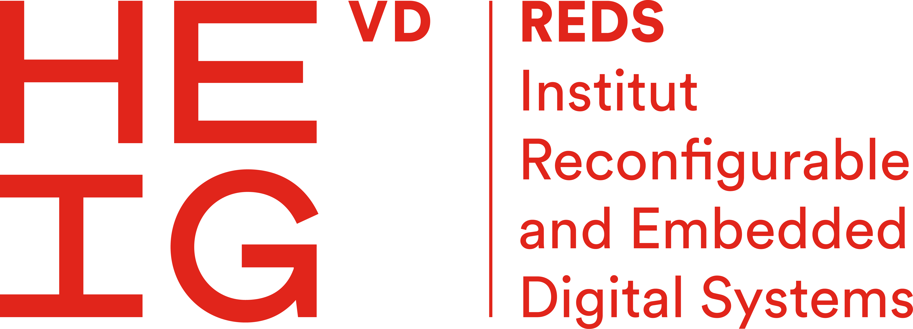

.. doc Documentation master file.

|

.. rst-class:: center

MICOFE - Micro-Container for Edge Computing
###########################################

.. rst-class:: left

MICOFE provides a highly secure, virtualized approach to deploy and manage
micro-services in embedded systems, combining the SOO mobile entity concept and
the SO3 operating system with Arm64 virtualization.

.. toctree::
   :maxdepth: 2
   :numbered:

   introduction
   architecture
   emiso
   portainer
   syscalls_alignment
   cpp
   lvgl
   demonstrator
   glossary

|

To edit the documentation and to use the correct underlying policy, you can read `this documentation style guide <https://documentation-style-guide-sphinx.readthedocs.io/en/latest/style-guide.html>`_.
