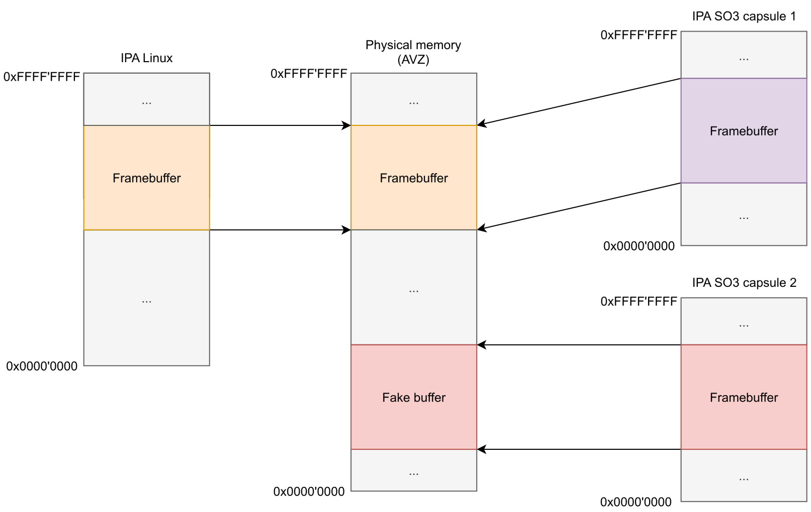
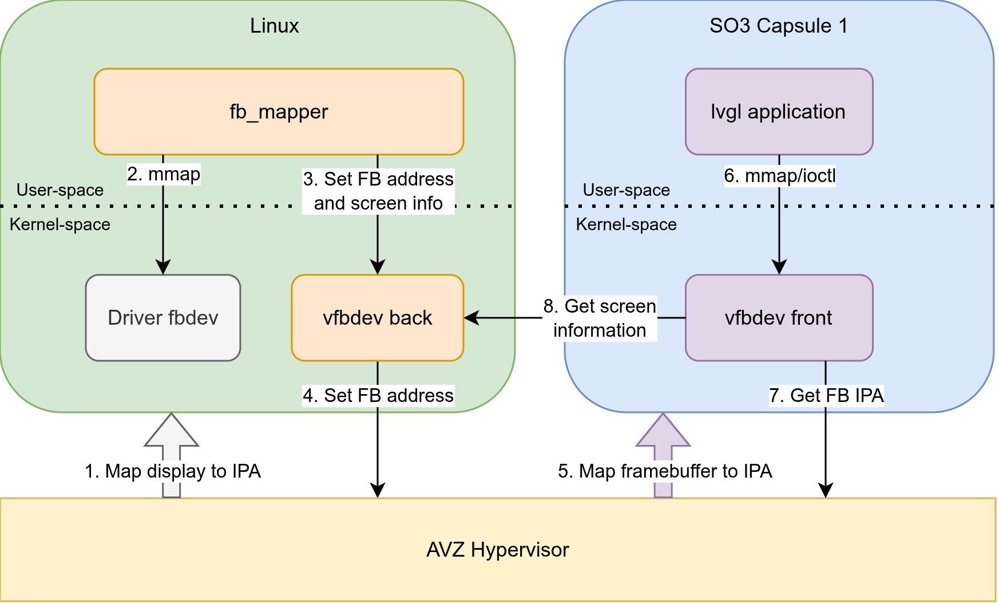

.. _lvgl:

Capsules and LVGL integration
#############################

*LVGL* is a library that enables the creation of graphical applications for
embedded devices and is already compatible with a standalone SO3 environment.
From the perspective of MICOFE, LVGL is important because it offers a realistic
application class for capsules: graphical workloads that are richer than
command-line examples and that make the benefits of isolation, portability, and
composition immediately visible.

Sharing the framebuffer
***********************

To support LVGL on capsules, the goal is to use Linux to drive the screen and add
a link between the capsule and Linux to seamlessly give access to the display,
like it is already done with UART for the terminal.

However, as the framebuffer represents the whole screen, it is much larger,
meaning that the current mechanism to share data between Linux and capsules is not
efficient as it only allows a small amount of memory pages to be shared. For
example, a screen of 1024x600 pixels with 16 bits per pixel uses 1'228'800 bytes,
or 300 memory pages, but AVZ only allows up to 32 pages to be shared.

Also, the application running on the capsule uses ``mmap`` at initialization to
get an address to the framebuffer and then does not interact with the kernel when
a new frame is available, meaning that the transmission should occur without the
kernel.

Finally, multiple capsules can run in parallel with their own graphical
application, but only one should be shown on screen.

Two-stage MMU address mapping
*****************************

To achieve this, the implementation takes benefit of the two stages of MMU, which
gives the physical (PA), intermediate physical (IPA) and virtual (VA) address
spaces. The address translation goes from VA to IPA, managed by Linux and the
capsules, and then from IPA to PA, managed by the hypervisor AVZ.

To avoid allocating multiple framebuffers and making copies between them, only two
buffers are allocated: the one used by the screen driver in Linux and a *fake* one.
A fixed IPA is used for the framebuffer seen by the capsules. Depending on the
focused capsule, their respective IPA are either mapped to the actual framebuffer
or the fake one.

   Framebuffer IPA and PA address map

Only the page tables of IPA to PA need to be changed to switch the shown capsules.
At any time, the framebuffer must only be mapped to one capsule to avoid glitches
on the screen. However, the fake buffer is shared between all hidden capsules, but
this is not considered a problem as it is only used to write data and never read.

Backend / frontend drivers
**************************

Like UART, a backend (on Linux) and frontend (on capsules) driver are implemented
to share the required information, like the screen size.

A user-space application on Linux is used to get the framebuffer address using
``mmap``, which is then given to the backend driver via a *sysfs* file and
transmitted to AVZ with a hypercall. The application then refreshes the screen to
ensure that images are shown correctly at 30 frames per second. A hypercall is also
added to switch focus to another capsule, which is called when switching the
terminal focus with two ``CTRL+A``, ensuring the same capsule is focused on
terminal and screen at the same time.

The frontend driver exposes the virtual framebuffer device to the LVGL application,
so it can use the standard API. The framebuffer IPA is retrieved with a hypercall.

   Flow and interaction for framebuffer on capsules

The first point is referencing mapping the HDMI port, GPU, and other addresses
required to access the display.

Input forwarding
****************

To allow user interaction with the LVGL application, the input of the keyboard,
mouse, and touchscreen must also be forwarded to the application. This is achieved
with a backend and frontend driver using the existing sharing process, as the
transmitted data sizes are small enough.

A user-space application is used to get events from all ``/dev/input`` files,
which are forwarded to the backend driver, then to the frontend and finally to the
LVGL application via device files.
